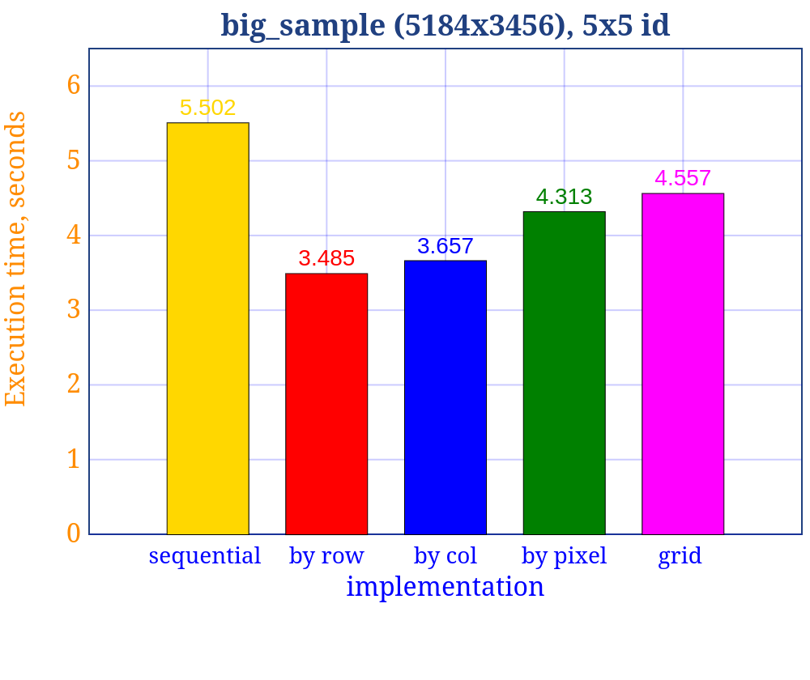
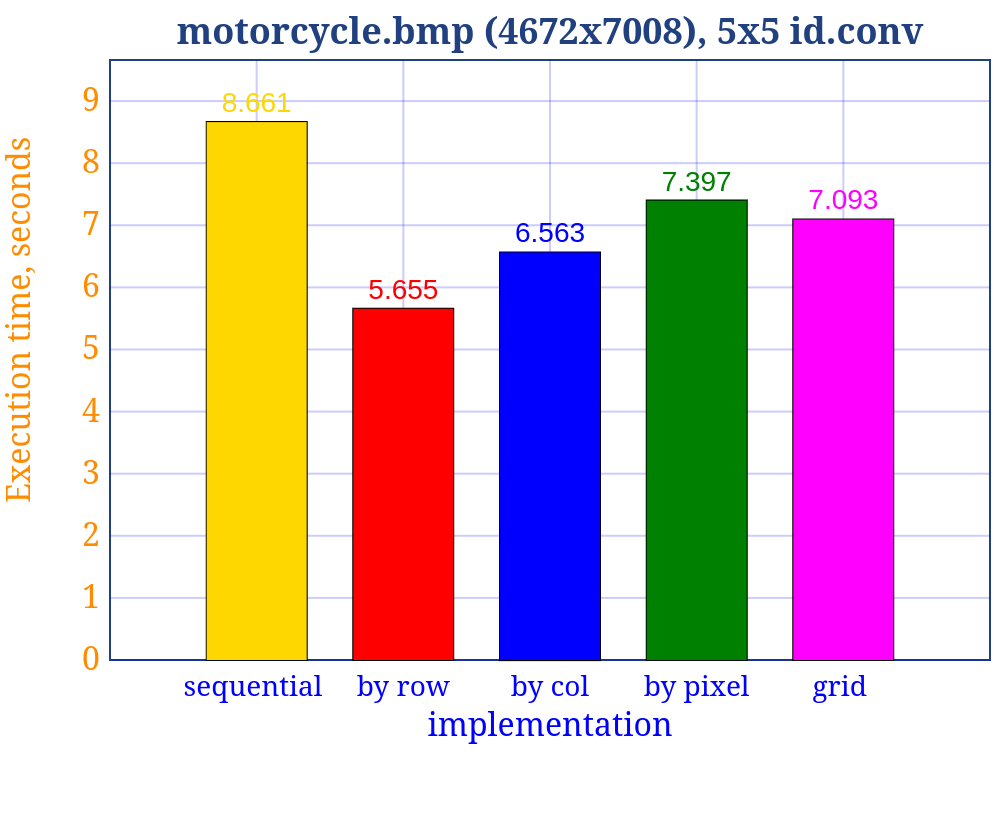
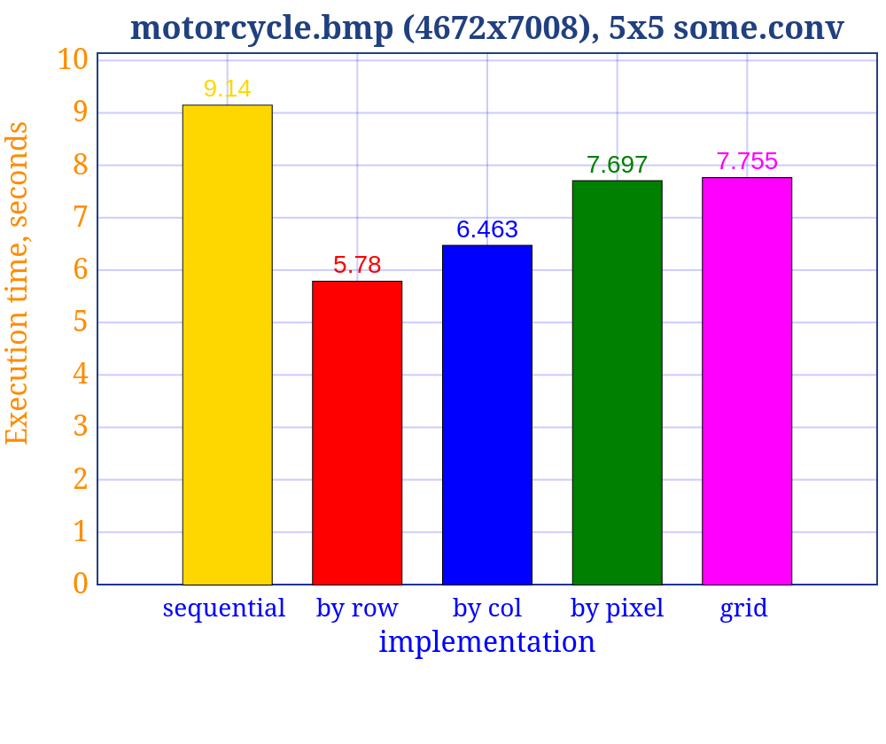

# Решение второй задачи
Реализованы параллельные версии.

Собрать всё можно с помощью:

```
make all
```

Запустить тесты можно с помощью:

```
make test
```

# Описание

- buffer_by_col --- распараллеливание по столбцам
- buffer_by_row --- распараллеливание по строкам
- buffer_by_pixel --- распараллеливание по пикселям
- buffer_random_grid --- каждый поток считает свёртку для того пикселя, на месте которого в решётке стоит номер этого потока

# Результаты (сравнение производительности)

Эксперимент проводился на машине со следующими
характеристиками: Linux Mint 22.1, Intel Core i3-7020U (2 cores, 4 threads), 2.30
GHz, DDR4 8GB RAM и Intel HD Graphics 620, 1.00 GHz; взято среднее арифметическое 5 запусков.






