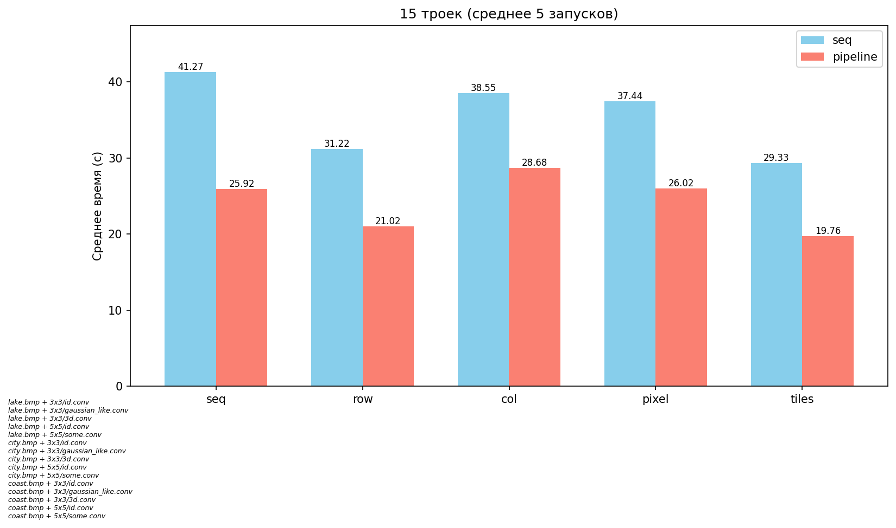
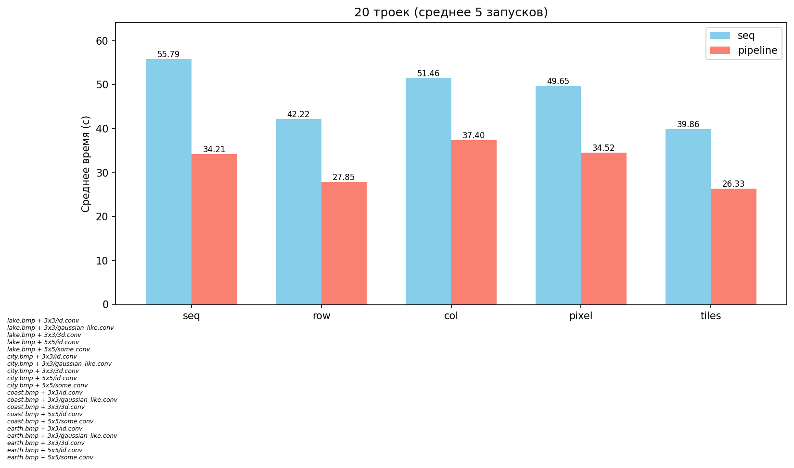
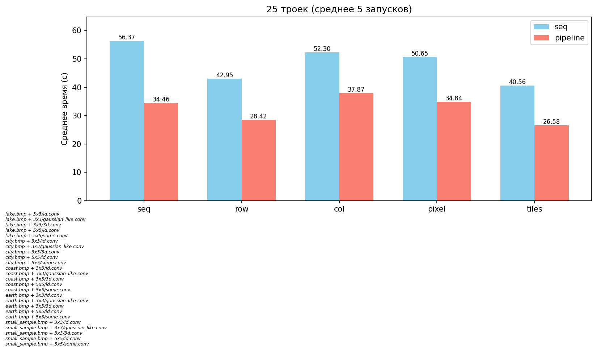
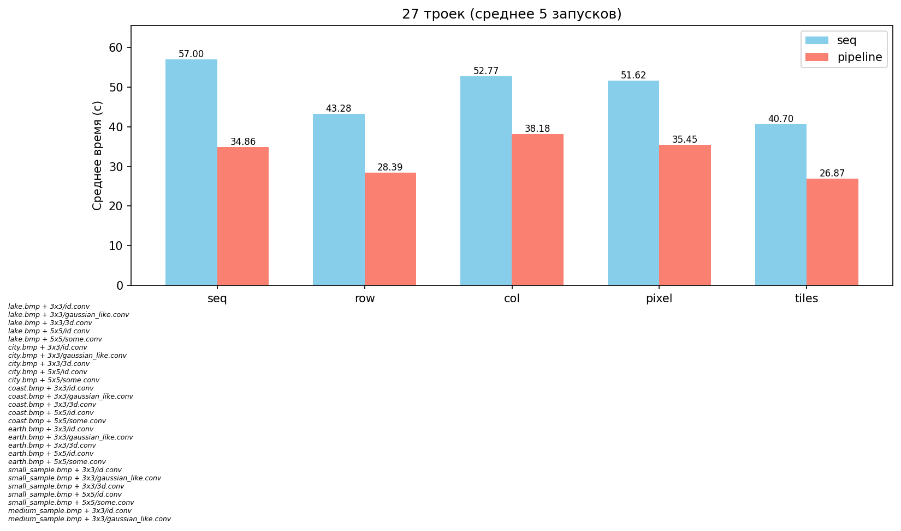
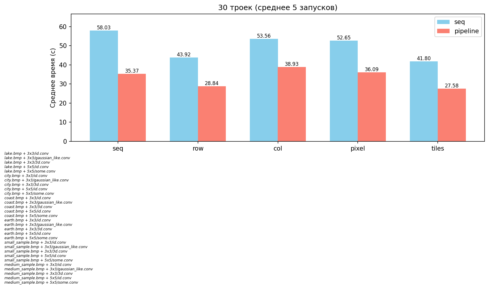

# Решение третьей задачи
Разделены чтение, свёртка и запись.

Собрать всё можно с помощью:

```
make all
```

Запустить тесты можно с помощью:

```
make test
```

# Описание

- buffer_by_col --- распараллеливание по столбцам
- buffer_by_row --- распараллеливание по строкам
- buffer_by_pixel --- распараллеливание по пикселям
- buffer_tiles --- распараллелено изображение по тайлам

# Результаты (сравнение производительности)

Эксперимент проводился на машине со следующими
характеристиками: Linux Mint 22.1, Intel Core i3-7020U (2 cores, 2 threads), 2.30
GHz, DDR4 8GB RAM и Intel HD Graphics 620, 1.00 GHz.
Проведены замеры для последовательной загрузки-свёртки-записи на разном числе троек
"входное изображение свёртка изображение для записи". Взято среднее арифметическое 5 запусков.

## 15 троек



## 20 троек



## 25 троек



## 27 троек



## 30 троек


