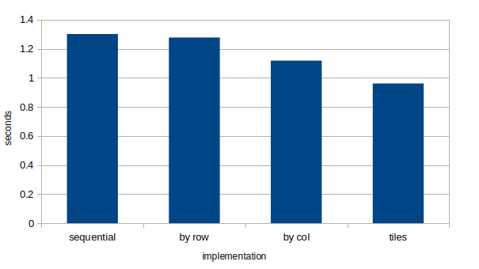
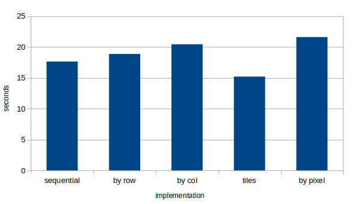

# Решение третьей задачи
Разделены чтение, свёртка и запись.

Собрать всё можно с помощью:

```
make all
```

Запустить тесты можно с помощью:

```
make test
```

# Описание

- buffer_by_col --- распараллеливание по столбцам
- buffer_by_row --- распараллеливание по строкам
- buffer_by_pixel --- распараллеливание по пикселям
- buffer_tiles --- распараллелено изображение по тайлам

# Результаты (сравнение производительности)

Эксперимент проводился на машине со следующими
характеристиками: Linux Mint 22.1, Intel Core i3-7020U (2 cores, 2 threads), 2.30
GHz, DDR4 8GB RAM и Intel HD Graphics 620, 1.00 GHz; взято среднее арифметическое 5 запусков.

## lake.bmp: 3x3 id.conv; small_sample.bmp: 5x5 some.conv; medium_sample.bmp: 5x5 id.conv



## big_sample.bmp: 5x5 some.conv; earth.bmp: 3x3 gaussian_like.conv; coast.bmp: 3x3 3d.conv;
## city.bmp: 5x5 id.conv




